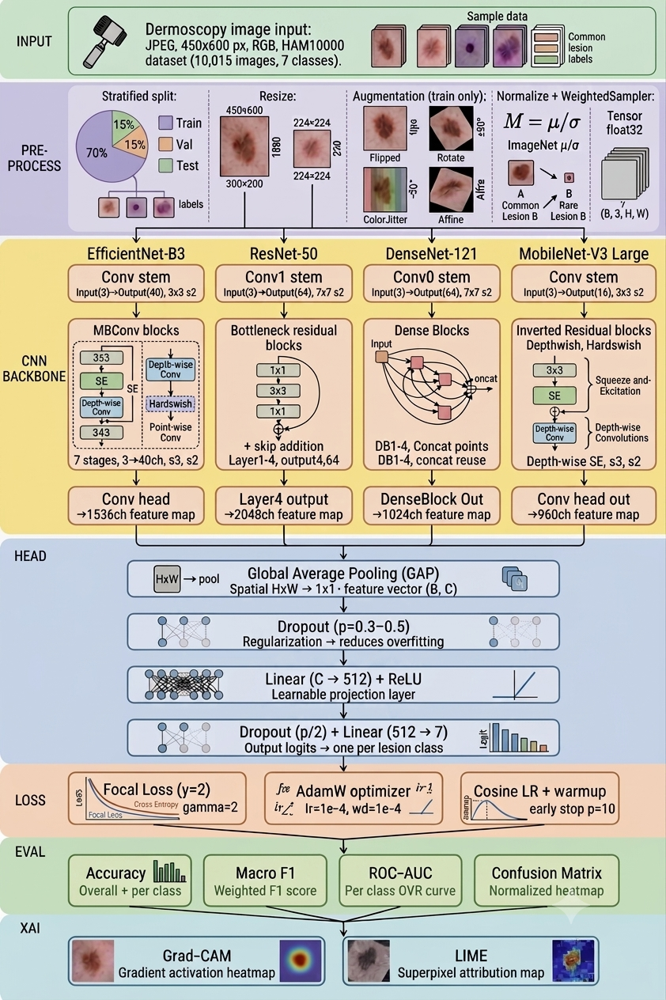

# 🔬 Skin Lesion Severity Classifier with CNN

A deep learning project for multi-class skin lesion classification using the **HAM10000 dataset**.
Compares 4 CNN architectures (EfficientNet-B3, ResNet-50, DenseNet-121, MobileNet-V3) and explains
predictions using Grad-CAM and LIME.

---

## 🎯 Project Goal

Classify dermoscopy images into 7 skin lesion categories and select the best model using a
comprehensive evaluation pipeline — then explain **why** the model made each prediction.

### Classes
| Code | Name | Description |
|------|------|-------------|
| `mel` | Melanoma | Malignant — most dangerous |
| `nv` | Melanocytic nevi | Benign moles |
| `bcc` | Basal cell carcinoma | Common skin cancer |
| `akiec` | Actinic keratoses | Pre-cancerous lesion |
| `bkl` | Benign keratosis | Non-cancerous |
| `df` | Dermatofibroma | Benign fibrous growth |
| `vasc` | Vascular lesions | Blood vessel related |

---
## 🏗️ Architecture



---
## 📂 Project Structure

```
skin-lesion-cnn/
├── configs/             # YAML config files per model
├── data/
│   ├── raw/             # Downloaded HAM10000 images (not committed)
│   └── processed/       # Preprocessed splits
├── notebooks/           # EDA and result visualization
├── results/
│   ├── checkpoints/     # Saved model weights
│   ├── plots/           # Training curves, confusion matrices
│   └── reports/         # Comparison reports, Grad-CAM outputs
├── src/
│   ├── data/            # Dataset class, augmentation, loaders
│   ├── models/          # Model zoo (4 architectures)
│   ├── training/        # Trainer, loss functions, schedulers
│   ├── evaluation/      # Metrics, comparison, reporting
│   └── explainability/  # Grad-CAM, LIME
├── tests/               # Unit tests
├── train.py             # Main training entry point
├── evaluate.py          # Run full evaluation
├── compare_models.py    # Compare all 4 models
├── explain.py           # Generate Grad-CAM / LIME outputs
└── requirements.txt
```

---

## 🚀 Quick Start

### 1. Install dependencies
```bash
pip install -r requirements.txt
```

### 2. Download dataset
```bash
python src/data/download_data.py
```
> Requires a Kaggle API key. See [Kaggle API setup](https://www.kaggle.com/docs/api).

### 3. Train a model
```bash
python train.py --model efficientnet --config configs/efficientnet.yaml
```

### 4. Compare all models
```bash
python compare_models.py
```

### 5. Generate explanations
```bash
python explain.py --model efficientnet --checkpoint results/checkpoints/best_efficientnet.pth
```

---

## 📊 Models Compared

| Model | Params | ImageNet Acc | Use Case |
|-------|--------|-------------|---------|
| EfficientNet-B3 | 12M | 81.6% | Best accuracy/size ratio |
| ResNet-50 | 25M | 76.1% | Strong baseline |
| DenseNet-121 | 8M | 74.9% | Proven in medical imaging |
| MobileNet-V3 | 5.4M | 75.2% | Deployment-ready |

---

## 📈 Metrics Tracked
- Accuracy (overall + per-class)
- Macro F1-score
- Weighted F1-score
- ROC-AUC (per class + macro)
- Confusion matrix
- Training time per epoch

---

## 📊 Results

### EfficientNet-B3 ✅
| Metric | Score |
|--------|-------|
| Accuracy | 82.0% |
| Macro F1 | 0.778 |
| Weighted F1 | 0.830 |
| ROC-AUC | 0.969 |

### ResNet-50 ✅
| Metric | Score |
|--------|-------|
| Accuracy | 65.4% |
| Macro F1 | 0.691 |
| Weighted F1 | 0.688 |
| ROC-AUC | 0.952 |

### DenseNet-121 ✅
| Metric | Score |
|--------|-------|
| Accuracy | 71.5% |
| Macro F1 | 0.725 |
| Weighted F1 | 0.743 |
| ROC-AUC | 0.968 |

### MobileNet-V3 ✅
| Metric | Score |
|--------|-------|
| Accuracy | 76.9% |
| Macro F1 | 0.748 |
| Weighted F1 | 0.789 |
| ROC-AUC | 0.962 |

---

## 🏆 Final Model Comparison

| Model | Accuracy | Macro F1 | Weighted F1 | ROC-AUC |
|-------|----------|----------|-------------|---------|
| **EfficientNet-B3** | **82.0%** | **0.778** | **0.830** | **0.969** |
| MobileNet-V3 | 76.9% | 0.748 | 0.789 | 0.962 |
| DenseNet-121 | 71.5% | 0.725 | 0.743 | 0.968 |
| ResNet-50 | 65.4% | 0.691 | 0.688 | 0.952 |

> 🥇 **Winner by Macro F1: MobileNet-V3** (0.748) | **Winner by Accuracy: EfficientNet-B3** (78.1%)

---

## 🧠 Explainability
- **Grad-CAM**: Highlights pixels the model focused on
- **LIME**: Superpixel-level feature attribution

---

## 📦 Dataset
- **HAM10000** — Human Against Machine with 10000 training images
- Available on [Kaggle](https://www.kaggle.com/datasets/surajghuwalewala/ham1000-segmentation-and-classification)
- 10,015 dermoscopic images, 7 classes, metadata CSV included

---

## 🗓️ Development Log
See [CHANGELOG.md](CHANGELOG.md) for commit-by-commit progress.
